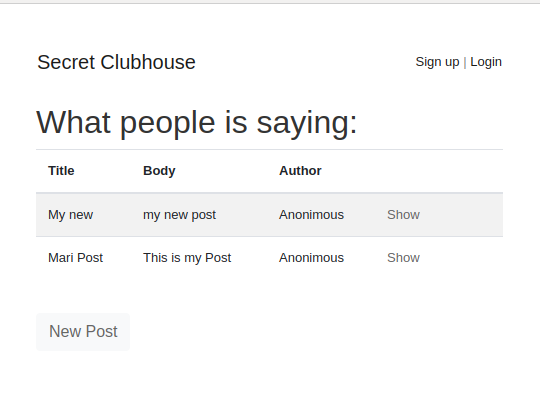
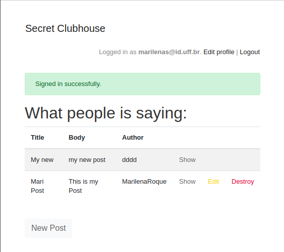

# Authentication Project with Rails

> In these project we worked to implement authentication systems so users can only access areas of a site they are authorized to.

> This project consists in build an exclusive clubhouse where your members can write embarrassing posts about non-members. Inside the clubhouse, members can see who the author of a post is but, outside, they can only see the story and wonder who wrote it.

 In this project we have:

- User model
- Post model

 Related to each other as displayed below:

- A user has zero or more posts
- A post belongs to a user

If you're not a member you can see the content of the post, but not the author:

If you're a member you can see the content of the post and its author

## Built With

- 'ruby' '2.7.1'
- 'rails', '~> 6.0.3', '>= 6.0.3.2'
- 'sqlite3', '~> 1.4'
- 'devise', '~> 4.7', '>= 4.7.2'

## Getting Started

​To have a version on your local machine:

- Clone this repository
- Open a terminal on the containing folder of this project
- Run 'bundle install' to install the dependencies
- Set the database using the command 'bin/rake db:migrate'
- Run the command 'rails server' on your terminal
- Access the URL below with your browser to play with the application features

> http://localhost:3000/

## Features

If you're not an authenticated member:

- Sign Up to the club
- Log in
- See the content of the posts but not the author of it.

 If you are an authenticated member:

- Create a post
- Update your posts
- See the content and author of the posts

## Authors

👤 **Marilena Roque**

- Github: [MarilenaRoque](https://github.com/MarilenaRoque)
- Twitter: [@MariRoq88285995](https://twitter.com/MariRoq88285995)
- Linkedin: [roquemarilena](https://www.linkedin.com/in/roquemarilena/)

👤 **Emanuel González**

- Github: [@emasdev](https://github.com/emasdev)
- Twitter: [@elemasss](https://twitter.com/elemass)
- Linkedin: [@emasdev](https://www.linkedin.com/in/emasdev/)

## 🤝 Contributing

Contributions, issues and feature requests are welcome!

Feel free to check the [issues page](issues/).

## Show your support

Give a ⭐️ if you like this project!

## Acknowledgments

- Hat tip to anyone whose code was used
- Inspiration
- etc

## 📝 License

This project is [MIT](lic.url) licensed.
